<!-- ================= HEADER ================= -->
<div align="center">



<br/>


<br/><br/>

<a href="https://nipunkumar.dev"></a>
<a href="https://linkedin.com/in/nipunkushwah"></a>
<a href="https://x.com/KushwahNipun"></a>
<a href="mailto:rajputnipun15@gmail.com"></a>

</div>

<br/>

<!-- ================= ABOUT ================= -->
## 🧑‍💻 About Me

I'm a B.Tech Computer Science graduate from Lovely Professional University. I build full-stack web apps, and lately I've been going deep on AI agents, RAG pipelines and a bit of Rust.

I like products that feel good to use: clean UI, smooth motion, and a backend that doesn't fall over.

```ts
const nipun = {
  role: "Software Engineer (entry-level)",
  location: "India 🇮🇳",
  currentlyBuilding: ["AI agent workspace", "Blockchain certificate verification"],
  strongAt: ["React", "TypeScript", "Node.js", "Express", "PostgreSQL", "MongoDB"],
  exploring: ["Rust (Axum)", "LLM APIs", "Vector search"],
  lookingFor: "Junior Full Stack / React / Node.js / AI app roles",
};
```
<!-- ================= TECH STACK ================= -->
## 🛠️ Tech Stack

<div align="center">



</div>

<!-- ================= PROJECTS ================= -->
## 🚀 Featured Projects

<table>
  <tr>
    <td width="50%" valign="top">
      <h3><a href="https://github.com/rajputnipun15/rig-ai-workspace">🤖 rig-ai-workspace</a></h3>
      Full-stack AI agent platform. Rust backend (Axum, SQLite, RIG) with a dark-mode React client, real-time streaming completions and vector similarity search.
      <br/><br/>
      
      
      
    </td>
    <td width="50%" valign="top">
      <h3><a href="https://github.com/rajputnipun15/certichain-blockchain-verification">⛓️ CertiChain</a></h3>
      Proof-of-Authority blockchain platform for issuing and verifying certificates, using Merkle trees and Ed25519 signatures.
      <br/><br/>
      
      
      
    </td>
  </tr>
  <tr>
    <td width="50%" valign="top">
      <h3><a href="https://github.com/rajputnipun15/my-instatic">📝 my-instatic</a></h3>
      Self-hosted CMS with an integrated visual editor, built on React, TypeScript, Vite and Bun.
      <br/><br/>
      
      
      
    </td>
    <td width="50%" valign="top">
      <h3><a href="https://github.com/rajputnipun15/Autonomous-QA-Agent">🧪 Autonomous-QA-Agent</a></h3>
      QA agent that drives a browser with Playwright and Node.js to test web apps on its own.
      <br/><br/>
      
      
      
    </td>
  </tr>
  <tr>
    <td width="50%" valign="top">
      <h3><a href="https://github.com/rajputnipun15/nipun-portfolio">🎨 nipun-portfolio</a></h3>
      Minimal, animated personal portfolio with Next.js, Tailwind, Framer Motion and GSAP.
      <br/><br/>
      
      
      
    </td>
    <td width="50%" valign="top">
      <h3><a href="https://github.com/rajputnipun15/SkillForge">⚒️ SkillForge</a></h3>
      Personal skill and project management platform to track what I'm learning and building.
      <br/><br/>
      
      
    </td>
  </tr>
</table>


<!-- ================= STATS ================= -->
## 📊 GitHub Analytics

<div align="center">


<br/><br/>

<picture>
  <source media="(prefers-color-scheme: dark)" srcset="https://raw.githubusercontent.com/rajputnipun15/rajputnipun15/output/github-snake-dark.svg" />
  <source media="(prefers-color-scheme: light)" srcset="https://raw.githubusercontent.com/rajputnipun15/rajputnipun15/output/github-snake.svg" />
  
</picture>

</div>

<!-- ================= CONNECT ================= -->
## 🤝 Let's Connect

I'm looking for junior full stack, React, Node.js and AI/LLM app roles (India or remote). If you're hiring or just want to talk code, my inbox is open.

<div align="center">

<a href="mailto:rajputnipun15@gmail.com"></a>


</div>
